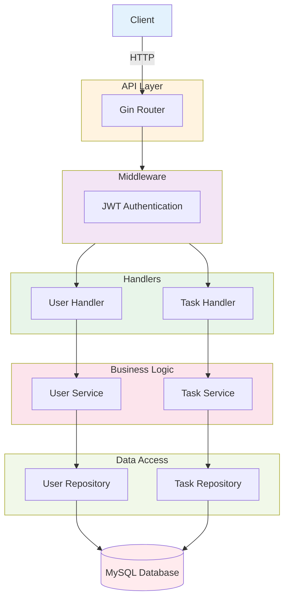

# TaskFlow Architecture

## Overview

TaskFlow is a task management API built with Go, following a **layered monolithic architecture**. The system is organized into clear separation of concerns across different layers, making it maintainable, testable, and scalable.



---

## Project Structure

```
taskflow/
│
├── internal/                    # Private application code
│   ├── auth/                    # Authentication & Authorization
│   │   ├── auth.go              # JWT middleware implementation
│   │   ├── auth_interface.go    # Auth interface contract
│   │   ├── auth_mock.go         # Mock for testing
│   │   └── auth_test.go         # Auth middleware tests
│   │
│   ├── common/                  # Shared utilities & types
│   │   └── response.go          # Standard API response format
│   │
│   ├── domain/                  # Core business entities
│   │   ├── task/
│   │   │   └── entity.go        # Task model with GORM tags
│   │   └── user/
│   │       └── entity.go        # User model with GORM tags
│   │
│   ├── dto/                     # Data Transfer Objects
│   │   ├── task.go              # Task request/response DTOs
│   │   └── user.go              # User request/response DTOs
│   │
│   ├── handler/                 # HTTP request handlers
│   │   ├── task/
│   │   │   ├── task_handler.go              # Task HTTP handlers
│   │   │   ├── task_handler_interface.go    # Handler contract
│   │   │   └── task_handler_test.go         # Handler tests
│   │   └── user/
│   │       ├── user_handler.go              # User HTTP handlers
│   │       ├── user_handler_interface.go    # Handler contract
│   │       └── user_handler_test.go         # Handler tests
│   │
│   ├── repository/              # Data access layer (GORM)
│   │   └── gorm/
│   │       ├── gorm_task/
│   │       │   ├── task_repository.go           # Task DB operations
│   │       │   ├── task_repository_interface.go # Repository contract
│   │       │   ├── task_repository_mock.go      # Mock for testing
│   │       │   └── task_repository_test.go      # Integration tests
│   │       └── gorm_user/
│   │           ├── user_repository.go           # User DB operations
│   │           ├── user_repository_interface.go # Repository contract
│   │           ├── user_repo_mock.go            # Mock for testing
│   │           └── user_repository_test.go      # Integration tests
│   │
│   └── service/                 # Business logic layer
│       ├── task/
│       │   ├── task_service.go              # Task business logic
│       │   ├── task_service_interface.go    # Service contract
│       │   ├── task_service_mock.go         # Mock for testing
│       │   └── task_service_test.go         # Unit tests
│       └── user/
│           ├── user_service.go              # User business logic
│           ├── user_service_interface.go    # Service contract
│           ├── user_service_mock.go         # Mock for testing
│           └── user_service_test.go         # Unit tests
│
├── pkg/                         # Reusable packages
│   ├── database/
│   │   └── connection.go        # DB connection, config, migrations
│   ├── env.go                   # Environment variable helpers
│   └── jwt/
│       ├── jwt.go               # JWT creation & validation
│       └── jwt_test.go          # JWT utility tests
│
├── test/
│   └── integration/
│       └── db_integration_test.go    # Database integration tests
│
├── main.go                      # Application entry point
├── Dockerfile                   # Production image (multi-stage)
├── Dockerfile.dev               # Development image (hot-reload)
├── docker-compose.yml           # Production composition
├── docker-compose.override.yml  # Development overrides
└── go.mod, go.sum               # Go module dependencies
```

---

## Architecture Layers

### 1. **API Layer** (`internal/handler/`)
**Responsibility**: Handle HTTP requests and responses

- **User Handler** (`user_handler.go`): Manages authentication endpoints
  - `Register()` - Create new user account
  - `Login()` - Authenticate user and issue JWT
  - `UpdatePassword()` - Change user password
  - `DeleteUser()` - Delete user account

- **Task Handler** (`task_handler.go`): Manages task endpoints
  - `CreateTask()` - Create new task
  - `GetTask()` - Fetch single task
  - `ListTasks()` - Fetch all user tasks
  - `UpdateStatus()` - Update task status
  - `Delete()` - Delete task

**Key Pattern**: All handlers implement their interface (`TaskHandlerInterface`, `UserHandlerInterface`) for testability and dependency injection.

### 2. **Middleware Layer** (`internal/auth/`)
**Responsibility**: Cross-cutting concerns (authentication, authorization)

- **AuthMiddleware**: Validates JWT tokens on protected routes
  - Extracts token from `Authorization: Bearer <token>` header
  - Validates token signature and expiration
  - Verifies user still exists (prevents deleted user access)
  - Sets user ID in request context
  - Returns `401 Unauthorized` if token invalid

- **OptionalAuthMiddleware**: Optional authentication for public routes
  - Doesn't reject requests without tokens
  - Sets user ID if valid token provided
  - Allows route handlers to check if user is authenticated

### 3. **Service Layer** (`internal/service/`)
**Responsibility**: Implement business logic and validation

- **User Service** (`user_service.go`):
  - `CreateUser()` - Validate email uniqueness, hash password, create user
  - `AuthenticateUser()` - Verify credentials, generate JWT token
  - `UpdatePassword()` - Validate old password, hash and update new one
  - `DeleteUser()` - Soft delete user (GORM handles deletion)

- **Task Service** (`task_service.go`):
  - `CreateTask()` - Validate input, create task with pending status
  - `GetTask()` - Fetch task with ownership verification
  - `ListTasks()` - Return all tasks for authenticated user
  - `UpdateStatus()` - Validate status value, update task
  - `Delete()` - Delete task with ownership check

**Key Pattern**: Services are where validation, business rules, and data transformation happen. They call repositories for DB operations and don't know about HTTP details.

### 4. **Repository Layer** (`internal/repository/gorm/`)
**Responsibility**: Data access abstraction using GORM ORM

- **Task Repository**:
  - `Create()` - Insert new task
  - `GetByID()` - Fetch task by ID with user verification
  - `List()` - Query all tasks for a user
  - `Update()` - Persist task changes
  - `Delete()` - Remove task from database
  - `UpdateStatus()` - Update only status field

- **User Repository**:
  - `Create()` - Insert new user
  - `GetByID()` - Fetch user by ID
  - `GetByEmail()` - Fetch user by email for login
  - `Update()` - Update user fields
  - `Delete()` - Soft delete user (GORM automatically)

**Key Pattern**: All repositories implement interfaces. Direct queries are parameterized to prevent SQL injection. GORM automatically handles soft deletes via `DeletedAt` field.

### 5. **Domain Layer** (`internal/domain/`)
**Responsibility**: Core business entities (data models)

- **User Entity**:
  ```go
  type User struct {
      ID        int           // Primary key
      Email     string        // Unique email
      Password  string        // Hashed password
      Tasks     []Task        // Related tasks (cascade delete)
      Timestamps              // CreatedAt, UpdatedAt
      DeletedAt gorm.DeletedAt // Soft delete support
  }
  ```

- **Task Entity**:
  ```go
  type Task struct {
      ID        int       // Primary key
      Task      string    // Task description
      Status    string    // pending/completed
      UserID    int       // Foreign key to User
      CreatedAt time.Time
  }
  ```

**Key Pattern**: Entities contain GORM tags for table structure and SWAGGER tags for API documentation.

### 6. **DTO Layer** (`internal/dto/`)
**Responsibility**: Request/response data structures (API contracts)

- **Request DTOs**: Validate and bind incoming JSON
  - `CreateTaskRequest` - Task with binding validation
  - `CreateUserRequest` - Email and password with min length
  - `AuthRequest` - Email/password for login

- **Response DTOs**: Shape outgoing JSON
  - `CreateTaskResponse` - Return created task data
  - `ListTasksResponse` - Paginated task list
  - `AuthResponse` - JWT token + user info

**Key Pattern**: DTOs use `binding` tags for validation, `example` tags for Swagger docs, and `json` tags for serialization.

---

## Security Features

### Authentication
- **JWT (JSON Web Tokens)**: 24-hour expiration
- **Bearer Token**: Passed in `Authorization: Bearer <token>` header
- **Token Validation**: Signature verification + expiration check

### Password Security
- **bcrypt Hashing**: Industry-standard password hashing with salt
- **Min Length**: 6 characters enforced at validation layer

### Data Protection
- **User Verification**: Deleted users cannot access even with valid token
- **Ownership Check**: Users can only access/modify their own tasks
- **SQL Injection Prevention**: GORM parameterized queries

### Soft Deletes
- Users can be recovered after deletion using `db.Unscoped()`
- Tasks cascade-delete when user is deleted

---

## Authentication Flow

```
1. User Registration
   POST /auth/register
   ├─ Validate email format & password length
   ├─ Hash password with bcrypt
   ├─ Create user in database
   └─ Return user ID & email

2. User Login
   POST /auth/login
   ├─ Look up user by email
   ├─ Compare provided password with hash
   ├─ Create JWT token (24h expiration)
   └─ Return token & user details

3. Protected Request
   GET /tasks (with Authorization header)
   ├─ Extract token from header
   ├─ Validate JWT signature
   ├─ Check token expiration
   ├─ Verify user exists in database
   ├─ Set userID in request context
   └─ Continue to handler
```

---

## Database Schema

### Users Table
```sql
CREATE TABLE users (
  id INT PRIMARY KEY AUTO_INCREMENT,
  email VARCHAR(255) UNIQUE NOT NULL,
  password VARCHAR(255) NOT NULL,
  created_at TIMESTAMP,
  updated_at TIMESTAMP,
  deleted_at TIMESTAMP NULL  -- Soft delete
);
```

### Tasks Table
```sql
CREATE TABLE tasks (
  id INT PRIMARY KEY AUTO_INCREMENT,
  task VARCHAR(255) NOT NULL,
  status VARCHAR(50) NOT NULL,  -- pending/completed
  user_id INT NOT NULL,
  created_at TIMESTAMP,
  FOREIGN KEY (user_id) REFERENCES users(id) ON DELETE CASCADE,
  INDEX (user_id)
);
```

---

## Dependency Injection

All components follow constructor-based dependency injection:

```go
// Repositories depend on *gorm.DB
repo := gorm_task.NewTaskRepository(db)

// Services depend on Repositories
svc := task_service.NewTaskService(repo)

// Handlers depend on Services
handler := task_handler.NewTaskHandler(svc, userAuth)

// Router connects everything
router.POST("/tasks", handler.CreateTask)
```

**Benefits**:
- Easy to test (inject mocks)
- Loose coupling (depend on interfaces)
- Clear dependency graph

---

## Testing Strategy

### Unit Tests
- **Services**: Mock repositories, test business logic
- **Repositories**: SQLite in-memory database
- **Auth**: Mock user repository, test JWT validation

### Integration Tests
- **Database**: Docker MySQL container (dockertest)
- **Full stack**: Handler → Service → Repository → DB

### Mocking Pattern
Each package provides `*Mock` types:
- `TaskServiceMock` - For testing handlers
- `TaskRepoMock` - For testing services
- `MockUserRepository` - For testing auth middleware

---

## Development vs Production

### Docker Images

**Production** (`Dockerfile`):
- Multi-stage build (smaller final image)
- Alpine Linux base
- Only compiled binary included

**Development** (`Dockerfile.dev`):
- Full Go toolchain
- Air (hot-reload on code changes)
- Swag (Swagger doc generation)

### Docker Compose

**Production** (`docker-compose.yml`):
- Production Dockerfile
- No volume mounts
- Environment-based config

**Development** (`docker-compose.override.yml`):
- Development Dockerfile
- Volume mounts for code
- Hot-reload enabled
- Healthchecks for MySQL

---

## API Endpoints

### Authentication (Public)
```
POST   /api/auth/register       # Create account
POST   /api/auth/login          # Get JWT token
```

### Tasks (Protected)
```
POST   /api/tasks               # Create task
GET    /api/tasks               # List all user tasks
GET    /api/tasks/:id           # Get single task
PATCH  /api/tasks/:id/status    # Update task status
DELETE /api/tasks/:id           # Delete task
```

### Users (Protected)
```
PATCH  /api/users/password      # Change password
DELETE /api/users/account       # Delete account
```

---

## Error Handling

Standard error response format:
```json
{
  "error": "authorization header required"
}
```

HTTP Status Codes:
- **201**: Created successfully
- **400**: Bad request (validation error)
- **401**: Unauthorized (invalid/missing token)
- **404**: Resource not found
- **409**: Conflict (duplicate email)
- **500**: Server error

---

## Environment Variables

```bash
# JWT Configuration
JWT_SECRET=ADD-YOUR-SECRET

# Database Configuration
MYSQL_USER=NEW-USER
MYSQL_PASSWORD=CHANGE-PASSWORD
MYSQL_HOST=mysql
MYSQL_PORT=3306
MYSQL_DATABASE=CHANGE-DB-NAME
```

---

## Key Design Patterns

| Pattern | Usage | Benefit |
|---------|-------|---------|
| **Repository Pattern** | Data access abstraction | Easy to swap databases, testable |
| **Service Layer** | Business logic isolation | Reusable across handlers, testable |
| **Dependency Injection** | Loose coupling | Easy testing with mocks |
| **Interface-based Design** | Define contracts | Mockable, polymorphic |
| **Soft Deletes** | Data recovery | Audit trail, undo capability |
| **JWT Tokens** | Stateless auth | Scalable, no session storage |
| **Layered Architecture** | Clear separation | Maintainable, scalable |

---